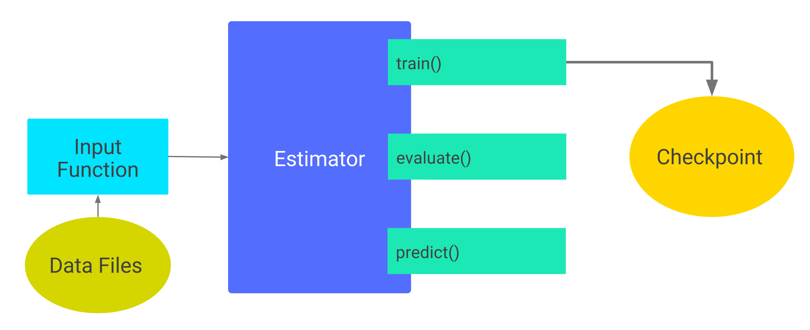

# 检查点

本文介绍如何保存和恢复编译有 Estimator 的 TensorFlow 模型。TensorFlow 提供两种模型格式：

*   检查点（checkpoints）：这是一种依赖于创建模型代码的格式。
*   SavedModel：这是一种与创建模型代码无关的格式。

本文关心的是检查点格式。对于 SavedModel 的细节内容，请参见 __TensorFlow 程序员指南__ 中的 @{$saved_model$保存和恢复} 章节。


## 示例代码

本文档同样依赖于 [Iris 数据分类示例](https://github.com/tensorflow/models/blob/master/samples/core/get_started/premade_estimator.py)，更多细节参见 @{$premade_estimators$TensorFlow 入门}。为下载和访问这个示例，可执行如下命令：

```shell
git clone https://github.com/tensorflow/models/
cd models/samples/core/get_started
```

本文中大部分代码片断都是在 `premade_estimator.py` 基础上少量修改的版本。


## 保存未训练完的模型

Estimators 自动将下列内容写到磁盘上：

*   **检查点**：训练过程中生成的不同版本的模型。
*   **事件文件**：包含一些用于 [TensorBoard](https://developers.google.com/machine-learning/glossary/#TensorBoard) 可视化的信息

为指定 Estimator 存储信息的顶层目录，将其赋值给任何一个 Estimator 的构造函数的可选参数 `model_dir`。比如  ，下列代码将 `model_dir` 参数设置为 `models/iris` 目录：

```python
classifier = tf.estimator.DNNClassifier(
    feature_columns=my_feature_columns,
    hidden_units=[10, 10],
    n_classes=3,
    model_dir='models/iris')
```

假定你调用 Estimator 的 `train` 方法。比如：

```python
classifier.train(
        input_fn=lambda:train_input_fn(train_x, train_y, batch_size=100),
                steps=200)
```

如下列图表所示，第一次调用 `train` 将检查点和其它文件添加到 `model_dir` 目录中：

<div style="width:80%; margin:auto; margin-bottom:10px; margin-top:20px;">

</div>
<div style="text-align: center">
第一次调用 train()。
</div>


在一个类 UNIX 系统中，可用命令 `ls` 来查看 `model_dir` 目录中的对象：

```none
$ ls -1 models/iris
checkpoint
events.out.tfevents.timestamp.hostname
graph.pbtxt
model.ckpt-1.data-00000-of-00001
model.ckpt-1.index
model.ckpt-1.meta
model.ckpt-200.data-00000-of-00001
model.ckpt-200.index
model.ckpt-200.meta
```

上面的 `ls` 命令显示，此 Estimator 在第 1 步（训练开始时）和第 200 步（训练结束时）生成了检查点。

### 默认检查点目录

如果你在一个 Estimator 构造函数中指定 `model_dir` 参数，此 Estimator 将检查点文件写到一个临时目录中，此目录由 Python 的 [tempfile.mkdtemp](https://docs.python.org/3/library/tempfile.html#tempfile.mkdtemp) 函数指定。比如，下面的 Estimator 构造函数并没有指定 `model_dir` 参数：

```python
classifier = tf.estimator.DNNClassifier(
    feature_columns=my_feature_columns,
    hidden_units=[10, 10],
    n_classes=3)

print(classifier.model_dir)
```

The `tempfile.mkdtemp` function picks a secure, temporary directory
appropriate for your operating system. For example, a typical temporary
directory on macOS might be something like the following:

```None
/var/folders/0s/5q9kfzfj3gx2knj0vj8p68yc00dhcr/T/tmpYm1Rwa
```

### Checkpointing Frequency

By default, the Estimator saves
[checkpoints](https://developers.google.com/machine-learning/glossary/#checkpoint)
in the `model_dir` according to the following schedule:

*   Writes a checkpoint every 10 minutes (600 seconds).
*   Writes a checkpoint when the `train` method starts (first iteration)
    and completes (final iteration).
*   Retains only the 5 most recent checkpoints in the directory.

You may alter the default schedule by taking the following steps:

1.  Create a @{tf.estimator.RunConfig$`RunConfig`} object that defines the
    desired schedule.
2.  When instantiating the Estimator, pass that `RunConfig` object to the
    Estimator's `config` argument.

For example, the following code changes the checkpointing schedule to every
20 minutes and retains the 10 most recent checkpoints:

```python
my_checkpointing_config = tf.estimator.RunConfig(
    save_checkpoints_secs = 20*60,  # Save checkpoints every 20 minutes.
    keep_checkpoint_max = 10,       # Retain the 10 most recent checkpoints.
)

classifier = tf.estimator.DNNClassifier(
    feature_columns=my_feature_columns,
    hidden_units=[10, 10],
    n_classes=3,
    model_dir='models/iris',
    config=my_checkpointing_config)
```

## Restoring your model

The first time you call an Estimator's `train` method, TensorFlow saves a
checkpoint to the `model_dir`. Each subsequent call to the Estimator's
`train`, `eval`, or `predict` method causes the following:

1.  The Estimator builds the model's
    [graph](https://developers.google.com/machine-learning/glossary/#graph)
    by running the `model_fn()`.  (For details on the `model_fn()`, see
    @{$custom_estimators$Creating Custom Estimators.})
2.  The Estimator initializes the weights of the new model from the data
    stored in the most recent checkpoint.

In other words, as the following illustration suggests, once checkpoints
exist, TensorFlow rebuilds the model each time you call `train()`,
`evaluate()`, or `predict()`.

<div style="width:80%; margin:auto; margin-bottom:10px; margin-top:20px;">

</div>
<div style="text-align: center">
Subsequent calls to train(), evaluate(), or predict()
</div>


### Avoiding a bad restoration

Restoring a model's state from a checkpoint only works if the model
and checkpoint are compatible.  For example, suppose you trained a
`DNNClassifier` Estimator containing two hidden layers,
each having 10 nodes:

```python
classifier = tf.estimator.DNNClassifier(
    feature_columns=feature_columns,
    hidden_units=[10, 10],
    n_classes=3,
    model_dir='models/iris')

classifier.train(
    input_fn=lambda:train_input_fn(train_x, train_y, batch_size=100),
        steps=200)
```

After training (and, therefore, after creating checkpoints in `models/iris`),
imagine that you changed the number of neurons in each hidden layer from 10 to
20 and then attempted to retrain the model:

``` python
classifier2 = tf.estimator.DNNClassifier(
    feature_columns=my_feature_columns,
    hidden_units=[20, 20],  # Change the number of neurons in the model.
    n_classes=3,
    model_dir='models/iris')

classifier.train(
    input_fn=lambda:train_input_fn(train_x, train_y, batch_size=100),
        steps=200)
```

Since the state in the checkpoint is incompatible with the model described
in `classifier2`, retraining fails with the following error:

```None
...
InvalidArgumentError (see above for traceback): tensor_name =
dnn/hiddenlayer_1/bias/t_0/Adagrad; shape in shape_and_slice spec [10]
does not match the shape stored in checkpoint: [20]
```

To run experiments in which you train and compare slightly different
versions of a model, save a copy of the code that created each
`model-dir`, possibly by creating a separate git branch for each version.
This separation will keep your checkpoints recoverable.

## Summary

Checkpoints provide an easy automatic mechanism for saving and restoring
models created by Estimators.

See the @{$saved_model$Saving and Restoring}
chapter of the *TensorFlow Programmer's Guide* for details on:

*   Saving and restoring models using low-level TensorFlow APIs.
*   Exporting and importing models in the SavedModel format, which is a
    language-neutral, recoverable, serialization format.
