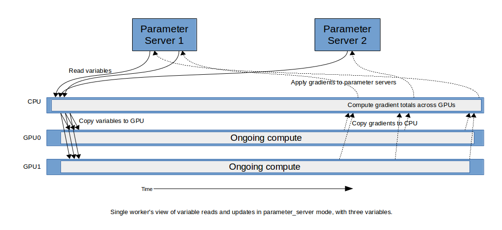
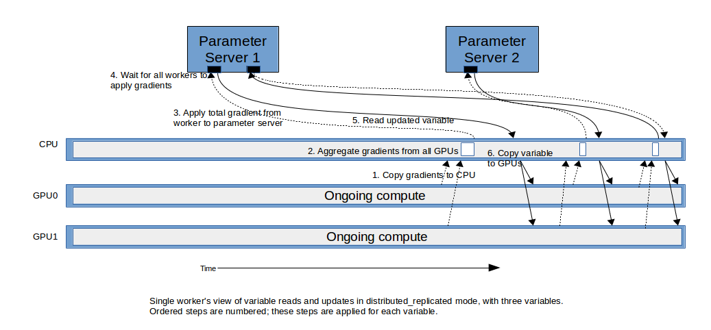

# 高性能模型

本文及相关[脚本](https://github.com/tensorflow/benchmarks/tree/master/scripts/tf_cnn_benchmarks)详细说明了如何构建能应对多种系统类型及网络拓扑的高可扩展模型。本文的技术利用了一些 TensorFlow Python 的底层组件。未来，其中的大部分技术将被整合进高层次的 API 里。

## 输入管道

[性能指南](../performance/performance_guide.md)解释了如何识别可能的输入管道问题和最佳实践。我们发现像类似采用 [AlexNet](http://papers.nips.cc/paper/4824-imagenet-classification-with-deep-convolutional-neural-networks.pdf) 训练 ImageNet 这种使用大量输入并每秒处理大量采样的场景下，采用 `tf.FIFOQueue` 和 `tf.train.queue_runner` 不能充分利用目前的 GPU 计算资源。这是因为底层实现采用的 Python 线程引入的额外开销太大导致的。

我们在[脚本](https://github.com/tensorflow/benchmarks/tree/master/scripts/tf_cnn_benchmarks)中采用的另一种方式是采用 TensorFlow 原生的并行机制来构建的输入管道。我们的实现由3个阶段构成：

*   I/O 读取： 从硬盘选择并读取图像。
*   图像处理： 将图像记录解码成图像，预处理并组织成 小批量（mini-batch）。
*   CPU-to-GPU 数据转移：将图像从 CPU 转移到 GPU。

每个阶段的关键步骤可以采用 `data_flow_ops.StagingArea` 和其他阶段并行执行。 `StagingArea` 是类似于 `tf.FIFOQueue` 的队列操作。不同之处在于 `StagingArea` 不保证先进先出的顺序，但提供了能在 CPU 和 GPU 上并行执行其他阶段的简单功能。将输入管道拆分为能并行执行的3个阶段是可扩展的，能充分发挥大量多核环境的优势。本章节后续将详细阐述这三个阶段以及使用 `data_flow_ops.StagingArea` 的细节。

### 并行 I/O 读取

`data_flow_ops.RecordInput` 用于处理并行从磁盘读取。对于包含 TFRecords 记录的一系列输入文件，`RecordInput` 将持续使用后台线程去读取记录。这些记录将被放入它自身的内部池；当载入超过它一半容量的数据量后，它将产生输出张量。

这个操作有它自己的由 I/O 时间控制且消耗最少 CPU 的内部线程，这使它能平缓地与模型的其他部分并行执行。

### 并行图像处理

从 `RecordInput` 读取图像后，它们被当做张量传递给图像处理管道。为了更容易解释图像处理管道，假设输入管道是面向 256 个批量大小的 8 个 GPU（每个 GPU 批量大小为32）。

256 条记录被独立并行地读取和处理。它起始于图中 256 个独立的 `RecordInput` 读操作。每个读操作之后是独立并行执行的一系列相同的图像前置处理操作。图像预处理操作包括对于图像的解码、变形、大小缩放等操作。

经过预处理之后，图像被连结成 8 个批量大小为 32 的张量。完成这一操作使用的是 `tf.parallel_stack`，不使用 `tf.concat` 则是因为它被实现成了单一操作需要等待所有输入就绪才能完成连接。`tf.parallel_stack` 分配了一个未初始化的张量作为输出， 每个输入张量就绪时就写入到输出张量的指定部分。

当所有输入张量完成后，输出张量在图中传递。这样有效地降低了生成所有输入张量带来的长尾内存延时。

### CPU 到 GPU 数据转移的并行处理

继续假设目标是采用 8个CPU，批量大小为256（每个 CPU 批量大小为32）。一旦输入图片被 CPU 被处理和连接完成，我们将得到 8 个张量，每个批量大小 32 。

TensorFlow 允许一个设备上的张量被任意其他设备直接使用。TensorFlow 使用隐式副本来使得张量能被任一设备使用。在张量被正式使用前，由运行时来安排在不同设备间完成复制。然而，如果复制不同及时完成，需要那些张量的计算会被暂停从而造成性能下降。

在这个实现中， `data_flow_ops.StagingArea` 被用来显式定义并行执行复制操作。最终的结果是，在 GPU 开始执行计算任务时，所有的张量已经就绪。

### 软件管道

因为所有的阶段能被不同的处理器执行，`data_flow_ops.StagingArea` 是其中用于并行执行，是类似 `tf.FIFOQueue` 一样的队列操作，提供了能被 CPU 和 GPU 执行的简单函数。在模型开始跑所有阶段之前，输入管道阶段被启动来将数据加载到运行时缓存中。每一个运行步骤在每个阶段开始前将从运行时缓存读取一段数据，并在最后写入一段数据

比如，有 A、B、C 三个阶段。有两个运行区域： S1 和 S2。在启动时，我们运行：

```
初始化:
步骤 1: A0
步骤 2: A1  B0

真实执行:
步骤 3: A2  B1  C0
步骤 4: A3  B2  C1
步骤 5: A4  B3  C2
```

在初始化之后，S1 和 S2 拥有了一组数据。在真正执行的每个步骤中，每个暂存区域将消耗一段数据，然后又会有新的一段数据加入其中。

这种方案的好处是：

*   所有阶段都不会被打断，因为每个区域都在预热之后都已经有一块数据
*   每个阶段都能并行执行，因为他们可以马上开始执行
*   运行时缓存是一个固定的额外内存开销。他们最多有一块额外的数据
*   运行这个步骤的所有阶段只需要调用一次 `session.run()` ，这使得信息收集和调试更加简单

## 构建高性能模型的最佳实践

下面这些额外的最佳时间能帮助提升性能和增强模型的灵活性。

### 同时采用 NHWC 和 NCHW 来构建模型

大部分 CNN 采用的 TensorFlow 操作同时支持 NHWC 和 NCHW 数据格式。NCHW 在 GPU 上更快，而 NHWC 在 CPU 上有时候更快。

架构同时支持这两种数据格式的模型能使得模型在不同的平台运行得更加灵活和高效。大部分 CNN 采用的 TensorFlow 操作同时支持 NHWC 和 NCHW 数据格式。基准脚本同时支持 NCHW 和 NHWC。 NCHW 在使用 GPU 来训练时应该被一直被采用。NHWC 在 CPU 上有时候更快。一个灵活的模型能在 GPU 上采用 NCHW 进行训练，同时利用在 CPU 上采用 NHWC 训练权重的结果。

### 采用混合标准化

TensorFlow 采用的默认标准化是采用复合操作。这是很常见的，但它经常导致性能下降。一个替代方案是采用混合标准化，这在 GPU 上经常拥有更好的性能。下面是一个采用 `tf.contrib.layers.batch_norm` 来实现复合标准化的实例。

```python
bn = tf.contrib.layers.batch_norm(
          input_layer, fused=True, data_format='NCHW'
          scope=scope)
```

## 可变分布和梯度聚合

在训练时，采用聚合梯度和差值来更新训练变量值。在基准脚本中，我们展示了采用灵活通用的 TensorFlow 元件构建了不同范围的高性能分布和聚合规则。

在这个脚本中包含了 3 个不同的分布和聚合方式：

*   `parameter_server` 训练模型副本从一个参数服务器读取变量和更新变量。当模型需要变量时，TensorFlow 运行时会复制它们并添加到使用环境。示例[脚本](https://github.com/tensorflow/benchmarks/tree/master/scripts/tf_cnn_benchmarks)阐释了采用这种方法来做本地训练、分布式同步训练和分布式异步训练。
*   `replicated` 在每个 GPU 上放置了每个训练变量的独立副本。因为变量已经就绪，前向和后向计算可以马上开始。梯度在所有 GPU 中累积，汇总结果会被应用到每一个 GPU 副本中来保持他们同步。
*   `distributed_replicated` 在每个 GPU 上放置了每个训练变量的独立副本，同时在参数服务器上放置一个主副本。因为变量已经就绪，前向和后向计算可以马上开始。梯度在每个服务器的所有 GPU 中累积，然后按服务器汇总后的梯度会被应用到主副本上。在所有处理器完成之后，每个处理器会从主副本上更新一份副本到自己的环境。

以下是每种方式的更多细节。

### 参数服务器变量

TensorFlow 模型管理训练变量的最常用方式是参数服务器模式。

在分布式系统中，每个处理器采用同一模型，由参数服务器处理变量的主副本。当处理器需要参数服务器的一个变量时，它可以直接使用。TensorFlow 运行时在图中添加了隐式副本来使得计算设备能在需要时使用变量值。当处理器计算完一个梯度后，这个梯度被发送给管理这个特殊变量的参数服务器，然后对应的最优控制器会更新这个变量。

有一些技术能优化吞吐量：

*   按照变量大小来将变量分布在不同参数服务器上，来实现负载均衡。
*   当每个处理器有多个 GPU 时，会将不同的 GPU 的梯度累积后统一发给参数服务器。这会减少网络带宽和参数服务器的工作量。

对于不同处理器的协同来说，一个常用方式是异步更新，每个处理器只更新主副本而不与其他处理器同步。在我们的模型中，我们展示在不同处理器间引入同步是很容易的，所以所有处理器能在一个步骤中在下一步骤开始前完成。

参数服务器方法也能被用来做本地训练。这种情况下，代替在不同参数服务期间传递变量的主副本，他们可以在 CPU 或 GPU 间传递。

因为这个配置非常简单，这个架构受到了社区广泛的欢迎。

这个方式可以通过在脚本中传入参数 `--variable_update=parameter_server` 来使用。

<div style="width:100%; margin:auto; margin-bottom:10px; margin-top:20px;">
  
</div>

### 重复变量

在这个设计中，服务器上的每个 GPU 有每个变量的一个副本。这些值在 GPU 中通过将完整聚合后的梯度应用到每个 GPU 中来保持同步。

这些变量和数据在训练开始时就可用，所以训练的前向处理能马上开始。梯度在不同设备间聚合后再被引用到每个本地副本中。

跨服务器的梯度聚合可以通过不同的方式完成：

*   采用标准 TensorFlow 操作来聚合每个 CPU 或 GPU 设备上的总和，然后复制回所有 GPU。
*   采用下面 NCCL 章节中介绍的 NVIDIA® NCCL 方法。

这种方式可以用过在脚本中传入参数 `--variable_update=replicated` 来使用。

### 分布式训练中的重复变量

变量的重复方法可以被扩展应用到分布式训练中。其中的一种方式是：就像重复模式一样，在集群中聚合所有梯度，然后在应用到每一个变量副本上。这个可能在脚本的某个后续版本中展示。这个脚本在这里展示了一种不同的变化。

在这种模式中，在每个 GPU 的变量副本之外，主副本被保存在参数服务器上。就像重复模式，训练可以使用本地变量副本马上开始。

随着权重的梯度变得可用，他们被发送回参数服务器，然后所有本地副本得到了更新：

1.  所有同一处理器上 GPU 的梯度会被聚合在一起。
2.  每个处理器的聚合梯度会被发送给负责变量的参数服务器，在那里会采用特定的优化处理器来更新变量的主副本。
3.  每个处理器根据主副本来更新它们的本地变量副本。在这个示例模型中，这是通过跨副本围栏来实现的，它等待所有处理器完成更新这些变量再在围栏释放了后获取新的变量。一旦所有变量的复制完成，一个训练步骤就完成了，一个新的步骤会开始。

虽然这听起来和参数服务器的标准用法类似，在很多场景下性能会更好。这很大程度上是因为计算不需要延迟，很多早期梯度的复制延迟倍后续的计算层隐藏了。

这个方式可以通过在脚本中传入参数 `--variable_update=distributed_replicated` 来使用。


<div style="width:100%; margin:auto; margin-bottom:10px; margin-top:20px;">
  
</div>

#### NCCL

为了在同一主机的不同 GPU 间传递变量和聚合梯度，我们采用了默认的 TensorFlow 隐式复制机制。

然而，我们也可以采用可选的 NCCL（`tf.contrib.nccl`）支持。NCCL 是一个能在不同 GPU 间高效传播和聚合数据的 NVIDIA® 库。它在每个 GPU 中安排一个协作内核来知道如何最好利用底层的硬件拓扑。这个内核使用了 GPU 的一个单一的 SM 。

在我们的实验中，我们展示了虽然 NCCL 经常自身能带来更快的数据聚合，它并不能带来更快的训练效果。我们假设隐式复制是无成本的，既然他们由 GPU 的复制引擎完成，并且它的延时能被主计算过程隐藏。虽然 NCCL 能更快地传输数据，它只使用了一个 SM，并且给依赖的 L2 缓存带来了更大的压力。我们的结果显示对于 8 个 GPU 来说，NCCL 经常能带来更好的性能。然而，对于更少的 GPU 来说，隐式复制反而表现更加出色。

#### 状态变量

我们进一步引入了状态变量模式，我们使用状态区来用于变量读取和更新。与输入管道的软件管道类似，这能隐藏数据复制延时。只要计算时间比复制和聚合时间长，复制本身的延时就变得无需考虑了。

它的缺点是所有的权重读取需要来自上一个训练步骤。所以它是与 SGD 不同的算法。但可以通过调整学习速率和其他参数来优化收敛性。

## 执行脚本

这一部分将列出核心的命令行参数和主要脚本（[tf_cnn_benchmarks.py](https://github.com/tensorflow/benchmarks/tree/master/scripts/tf_cnn_benchmarks/tf_cnn_benchmarks.py)）的一些基本用法示例。

> 说明： `tf_cnn_benchmarks.py` 采用 TensorFlow 1.1 后引入的 `force_gpu_compatible` 配置。直到 TensorFlow 1.2 之后，才建议从源码进行编译。

#### 基本命令行参数

*   **`model`**: 使用的模型，比如 `resnet50`, `inception3`, `vgg16`, 或 `alexnet`
*   **`num_gpus`**: 使用的 GPU 数量。
*   **`data_dir`**: 待处理数据的路径。如未设置，人造数据将被使用。请参照 [使用说明](https://github.com/tensorflow/models/tree/master/research/inception#getting-started) 来使用 ImageNet 数据。
*   **`batch_size`**: 每个 CPU 的位大小。
*   **`variable_update`**: 变量管理方法：`parameter_server`,`replicated`, `distributed_replicated`, `independent`
*   **`local_parameter_device`**: 参数服务器的使用设备：`cpu` 或 `gpu`

#### 单一实例示例

```bash
# VGG16 使用 8 个 GPU 来训练 ImageNet，参数针对 Google 计算引擎进行了优化
python tf_cnn_benchmarks.py --local_parameter_device=cpu --num_gpus=8 \
--batch_size=32 --model=vgg16 --data_dir=/home/ubuntu/imagenet/train \
--variable_update=parameter_server --nodistortions

# VGG16 使用 8 个 GPU 来训练合成 ImageNet 数据，参数针对 NVIDIA DGX-1 进行了优化
python tf_cnn_benchmarks.py --local_parameter_device=gpu --num_gpus=8 \
--batch_size=64 --model=vgg16 --variable_update=replicated --use_nccl=True

# VGG16 使用 8 个 GPU 来训练合成 ImageNet 数据，参数针对 Amazon EC2 进行了优化
python tf_cnn_benchmarks.py --local_parameter_device=gpu --num_gpus=8 \
--batch_size=64 --model=vgg16 --variable_update=parameter_server

# ResNet-50 使用 8 个 GPU 来训练 ImageNet，参数针对 Amazon EC2 进行了优化
python tf_cnn_benchmarks.py --local_parameter_device=gpu --num_gpus=8 \
--batch_size=64 --model=resnet50 --variable_update=replicated --use_nccl=False
```

#### 分布式命令参数

*   **`ps_hosts`**: 以逗号分隔的参数服务器主机列表，格式为 ```<host>:port```，比如 ```10.0.0.2:50000```。
*   **`worker_hosts`**: 以逗号分隔的参数工作站主机列表，格式为 ```<host>:port```，比如 ```10.0.0.2:50001```。
*   **`task_index`**: 开始主机在 `ps_hosts` 或 `worker_hosts` 列表中的索引。
*   **`job_name`**: 任务类型，比如 `ps` 或 `worker`

#### 分布式示例

以下是在 2 台主机上训练 ResNet-50的示例，主机分别为：host_0 (10.0.0.1) 和 host_1 (10.0.0.2)。这个示例采用了人造数据。可以传入 `--data_dir` 参数来使用真实数据。

```bash
# 在 host_0 (10.0.0.1) 上运行以下命令:
python tf_cnn_benchmarks.py --local_parameter_device=gpu --num_gpus=8 \
--batch_size=64 --model=resnet50 --variable_update=distributed_replicated \
--job_name=worker --ps_hosts=10.0.0.1:50000,10.0.0.2:50000 \
--worker_hosts=10.0.0.1:50001,10.0.0.2:50001 --task_index=0

python tf_cnn_benchmarks.py --local_parameter_device=gpu --num_gpus=8 \
--batch_size=64 --model=resnet50 --variable_update=distributed_replicated \
--job_name=ps --ps_hosts=10.0.0.1:50000,10.0.0.2:50000 \
--worker_hosts=10.0.0.1:50001,10.0.0.2:50001 --task_index=0


# 在 host_1 (10.0.0.2) 上运行以下命令:
python tf_cnn_benchmarks.py --local_parameter_device=gpu --num_gpus=8 \
--batch_size=64 --model=resnet50 --variable_update=distributed_replicated \
--job_name=worker --ps_hosts=10.0.0.1:50000,10.0.0.2:50000 \
--worker_hosts=10.0.0.1:50001,10.0.0.2:50001 --task_index=1

python tf_cnn_benchmarks.py --local_parameter_device=gpu --num_gpus=8 \
--batch_size=64 --model=resnet50 --variable_update=distributed_replicated \
--job_name=ps --ps_hosts=10.0.0.1:50000,10.0.0.2:50000 \
--worker_hosts=10.0.0.1:50001,10.0.0.2:50001 --task_index=1

```
