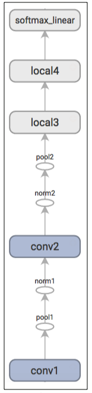
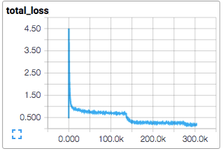
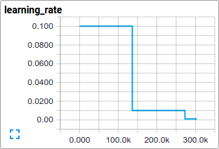
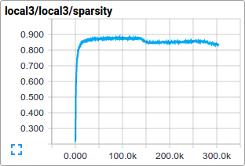
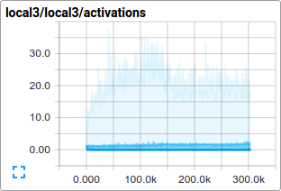
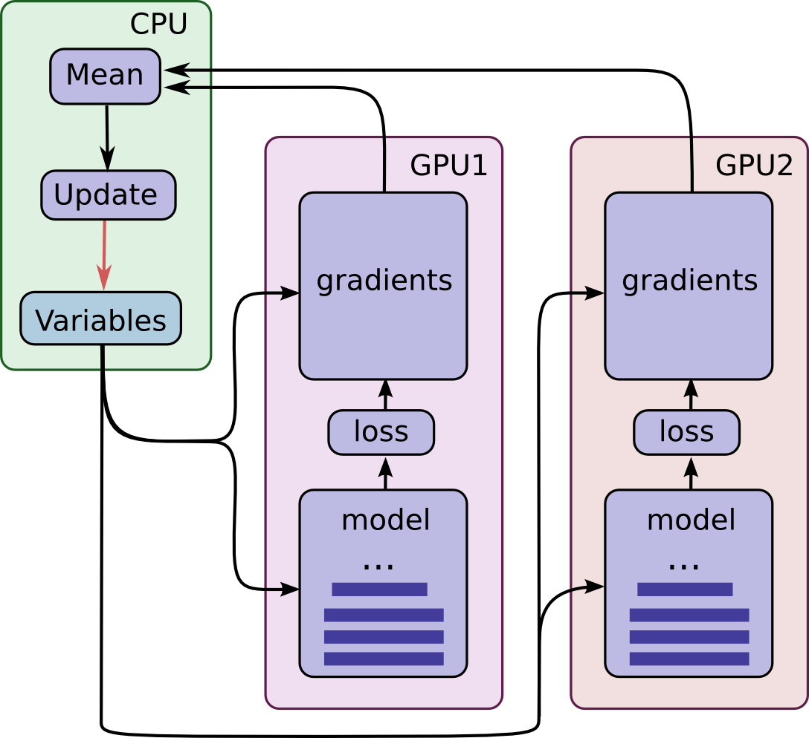

# Advanced Convolutional Neural Networks

## 概述

对 CIFAR-10 数据集的分类是机器学习中一个常用的基准测试问题。它的任务是对于一组像素为 32x32 的 RGB 图形进行分类，这些图像包含了 10 个类别：

```
飞机，汽车，鸟，猫，鹿，狗，青蛙，马，船以及卡车。
```

想了解更多数据集信息请参考 [CIFAR-10 page](https://www.cs.toronto.edu/~kriz/cifar.html)，以及 Alex Krizhevsky 写的[技术报告](https://www.cs.toronto.edu/~kriz/learning-features-2009-TR.pdf)。

### 目标

本教程的的目标是创建一个用于图像识别的相对小型的[卷积神经网络（CNN）](https://en.wikipedia.org/wiki/Convolutional_neural_network)。在这个过程中，本教程将会：

1. 着重于创建一个规范的网络组织结构，训练并进行评估；
2. 为建立更大型更为复杂精准的模型提供一个范例。

之所以选择 CIFAR-10 数据集，是因为它的复杂程度足以训练 TensorFlow 的大部分功能，并可以扩展为更大的模型。同时，由于模型较小因此训练速度很快，这样比较适合测试新想法和试验新的技术。

### 本教程重点

CIFAR-10 教程示范了一些在 TensorFlow 上构建更大更复杂模型的重要构想：

* 相关核心数学组件，包括 `tf.nn.conv2d`（[wiki](https://en.wikipedia.org/wiki/Convolution)）、`tf.nn.relu`（[wiki](https://en.wikipedia.org/wiki/Rectifier_(neural_networks))）、`tf.nn.max_pool`（[wiki](https://en.wikipedia.org/wiki/Convolutional_neural_network#Pooling_layer)）和 `tf.nn.local_response_normalization`（[AlexNet 论文](https://papers.nips.cc/paper/4824-imagenet-classification-with-deep-convolutional-neural-networks.pdf)的 3.3 章节）
* 训练过程中网络行为的[可视化](../../guide/summaries_and_tensorboard.md)，包括输入图像、损失情况、行为分布情况和梯度
* 为计算学习到的参数的 `tf.train.ExponentialMovingAverage` 提供范例，以及在评估阶段使用这些平均值来提高预测的性能
* 实现让 `tf.train.exponential_decay` 随着时间推移平稳地递减
* 为输入数据设计预存取 `tf.train.shuffle_batch`，将磁盘延迟和高开销图像预处理操作的模型分离进行处理

我们也提供了模型的多 GPU 版本并以此表明：

* 可以对模型进行配置使其能够在多个 GPU 上并行训练
* 可以在多个 GPU 之间共享和更新变量值

我们希望本教程可以提供一个起点，使得大家可以在 TensorFlow 上为视觉相关的任务创建更大型的 CNN 模型。

### 模型架构

CIFAR-10 教程中的模型是一个多层架构，由卷积层和非线性层交替排列而成。这些层最终通过全连接层对接到 SoftMax 分类器上。这个模型除了顶部几层外略有区别，其他方面和 [Alex Krizhevsky](https://code.google.com/p/cuda-convnet/) 描述的架构基本一致。

在 GPU 上训练了几个小时后，该模型最高可以达到 86% 的准确度。细节请查看[下面](#评估模型)的介绍和代码。模型中包含了 1068298 个学习参数，对一副图像进行分类大概需要 1950 万个乘加操作。

## 代码组织结构

本教程的代码位于 [`models/tutorials/image/cifar10/`](https://github.com/tensorflow/models/tree/master/tutorials/image/cifar10/)。

文件 | 作用
--- | ---
[`cifar10_input.py`](https://github.com/tensorflow/models/tree/master/tutorials/image/cifar10/cifar10_input.py) | 读取本地 CIFAR-10 的二进制文件内容
[`cifar10.py`](https://github.com/tensorflow/models/tree/master/tutorials/image/cifar10/cifar10.py) | 建立 CIFAR-10 模型
[`cifar10_train.py`](https://github.com/tensorflow/models/tree/master/tutorials/image/cifar10/cifar10_train.py) | 在 CPU 或者 GPU 上训练 CIFAR-10 模型
[`cifar10_multi_gpu_train.py`](https://github.com/tensorflow/models/tree/master/tutorials/image/cifar10/cifar10_multi_gpu_train.py) | 在多个 GPU 上训练 CIFAR-10 模型
[`cifar10_eval.py`](https://github.com/tensorflow/models/tree/master/tutorials/image/cifar10/cifar10_eval.py) | 评估 CIFAR-10 模型的预测性能

## CIFAR-10 模型

CIFAR-10 网络主要的代码位于 [`cifar10.py`](https://github.com/tensorflow/models/tree/master/tutorials/image/cifar10/cifar10.py)。完整的训练图大致包含 765 个操作。但是我们发现通过下面的模块来构造训练图可以最大程度的提供代码的复用率：

1. **模型输入：**包括 `inputs()` 和 `distorted_inputs()` 操作，分别用于读取 CIFAR 的图像和对其进行预处理，并用于后续评估和训练。
2. **模型预测：**包括 `inference()` 操作，用于推断。比如对于提供的图像进行分类。
3. **模型训练：**包括 `loss()` 和 `train()` 操作，用于计算损失、梯度计算、变量更新以及可视化最终结果。

### 模型输入

模型输入是通过 `inputs()` 和 `distorted_inputs()` 函数建立起来，它们会从 CIFAR-10 的二进制文件中读取图片数据。由于这些文件存储的字节长度固定，因此我们可以使用 `tf.FixedLengthRecordReader` 进行读取。更多关于 `Reader` 类的功能可以查看[数据读取](../../api_guides/python/reading_data.md#reading-from-files)。

图片的处理流程如下：

*  图片会被统一裁剪成 24x24 像素大小，中央区域裁剪用于评估或 `tf.random_crop` 用于训练；
*  对图片进行 `tf.image.per_image_standardization`，使得模型对于图片的动态范围变化不敏感。

对于训练，我们另外采取了一些列随机变换的方法来认为的增加数据集的大小：

* 对图片 `tf.image.random_flip_left_right`
* 对图片 `tf.image.random_brightness`
* 对图片 `tf.image.random_contrast`

你可以在[图片](../../api_guides/python/image.md)页面的列表中查看所有可用的变换。对于每一张图片我们还附带了一个 `tf.summary.image` 操作来查看图片概要，以便于在 [TensorBoard](../../guide/summaries_and_tensorboard.md) 中查看他们。这对于检查输入图片是否正确十分有效。

<div style="width:50%; margin:auto; margin-bottom:10px; margin-top:20px;">
  
</div>

从硬盘中加载图片并进行变换需要花费不少的时间，为了避免这些操作减慢训练过程，我们在 16 个独立的线程中运行这些操作，这些线程被连续的安排在一个 TensorFlow 的 `tf.train.shuffle_batch` 中。

### 模型预测

模型预测过程通过 `inference()` 函数进行构造，该函数会增加操作来计算预测值的 *logits*，其对应模型的组织方式如下： 

Layer 名称 | 描述
--- | ---
`conv1` | `tf.nn.conv2d` 和 `tf.nn.relu` 激活
`pool1` | `tf.nn.max_pool`
`norm1` | `tf.nn.local_response_normalization`
`conv2` | `tf.nn.conv2d` 和 `tf.nn.relu` 激活
`norm2` |  `tf.nn.local_response_normalization`
`pool2` | `tf.nn.max_pool`
`local3` | [fully connected layer with rectified linear activation](../../api_guides/python/nn.md)
`local4` | [fully connected layer with rectified linear activation](../../api_guides/python/nn.md)
`softmax_linear` | 进行线性变换以输出 logits

这里有一个通过 TensorBoard 绘制的图形，用来描述模型建立中经过的步骤：

<div style="width:15%; margin:auto; margin-bottom:10px; margin-top:20px;">
  
</div>

> **练习**：`inference` 的输出是未经归一化的 logits，尝试使用 `tf.nn.softmax` 对网络架构进行修改，从而返回归一化的预测结果。

`input()` 和 `inference()` 函数提供了所有评估模型所需要的必要构件，现在我们把讲解的重点从构建模型操作转向训练一个模型。

> **练习**：`inference()` 中的模型架构跟 [cuda-convnet](https://code.google.com/p/cuda-convnet/) 中描述的 CIFAR-10 模型有一些不同。尤其是，AlexNet 的原始模型顶层是局部连接而并非全连接，可以尝试修改网络架构来准确的重现顶层局部连接的模型架构。

### 模型训练

训练一个可以进行 N 类分类网络常用方法是使用[多项逻辑回归](https://en.wikipedia.org/wiki/Multinomial_logistic_regression)方法，又可以叫做 **softmax 回归**。Softmax regression applies a `tf.nn.softmax` nonlinearity to the output of the network and calculates the `tf.nn.sparse_softmax_cross_entropy_with_logits$cross-entropy` between the normalized predictions and the label index. 在正则化过程中，我们会对所有学习的变量应用常用的 `tf.nn.l2_loss` 损失方法。模型的目标函数是求交叉熵损失和所有权重衰减项的和，`loss()` 函数的返回值就是这个值。

我们可以使用 `tf.summary.scalar` 在 TensorBoard 中查看该值得变化情况：



我们使用标准的[梯度下降算法](https://en.wikipedia.org/wiki/Gradient_descent)来训练模型（你也可以在[训练](../../api_guides/python/train.md)中查看其它方法），其学习速率随着时间以 `tf.train.exponential_decay`。



`train()` 函数会添加一些操作来使得目标函数最小化，这些操作包括梯度计算、更新学习变量（详情可查看 `tf.train.GradientDescentOptimizer`）。`train()` 函数最终会返回一个用来对一批图片执行所有计算的操作，以便于训练并更新模型。

## 开始并训练模型

我们已经建立了模型，现在通过执行脚本 `cifar10_train.py` 来启动训练过程。

```shell
python cifar10_train.py
```

> **注意：**在第一次你开始任何 CIFAR-10 教程中的任务时，脚本会自动下载 CIFAR-10 数据集，数据集大约有 160 MB，所以你可以在第一次运行时泡杯咖啡休息一会。

你应该会看到类似如下的输出：

```shell
Filling queue with 20000 CIFAR images before starting to train. This will take a few minutes.
2015-11-04 11:45:45.927302: step 0, loss = 4.68 (2.0 examples/sec; 64.221 sec/batch)
2015-11-04 11:45:49.133065: step 10, loss = 4.66 (533.8 examples/sec; 0.240 sec/batch)
2015-11-04 11:45:51.397710: step 20, loss = 4.64 (597.4 examples/sec; 0.214 sec/batch)
2015-11-04 11:45:54.446850: step 30, loss = 4.62 (391.0 examples/sec; 0.327 sec/batch)
2015-11-04 11:45:57.152676: step 40, loss = 4.61 (430.2 examples/sec; 0.298 sec/batch)
2015-11-04 11:46:00.437717: step 50, loss = 4.59 (406.4 examples/sec; 0.315 sec/batch)
...
```

脚本会在每 10 步训练过程后打印出总损失值，以及最后一批数据的处理速度。下面是几点提醒：

* 第一批数据处理会非常的慢（大概需要几分钟），因为预处理线程需要把 20000 个待处理的 CIFAR 图片填充到乱序队列中

* 打印出来的损失值是最近一批数据损失值的均值，要记住这些损失值是交叉熵和所有权重衰减项的和

* 看一下上面一批数据的处理速度，这些处理速度是在 Tesla K40c 上计算出来的，如果你使用 CPU 运行，性能会比上述结果差

> **练习：** 在实验时，第一阶段训练时间会很长，长到让人厌烦。可以尝试减少初始化时填充到队列中的图片数量来改变这样的长期等待的情况。在 `cifar10_input.py` 脚本中搜索 `min_fraction_of_examples_in_queue` 来进行修改。

`cifar10_train.py` 脚本会周期性的在 [checkpoint files](../../guide/saved_model.md) 中使用了一个 `tf.train.Saver` 来保存模型的所有参数，但是**不会**对于模型进行评估。`cifar10_eval.py` 脚本会使用该检查点文件来测试预测的性能（详见下面：评估模型）。

如果你根据上面的步骤做下来，那么你已经开始训练一个 CIFAR-10 模型了。[恭喜！](https://www.youtube.com/watch?v=9bZkp7q19f0)

`cifar10_train.py` 脚本输出的终端信息提供了一部分关于模型如何训练的信息。我们想在训练过程中了解更多关于模型训练的信息：

* 损失是**真的**在减小还是看到的只是噪声信息？
* 为模型提供的图片是否合适？
* 梯度、激活和权重的值是否合理？
* 当前的学习速率是多少？

[TensorBoard](../../guide/summaries_and_tensorboard.md) 提供了这样的功能，可以通过 `cifar10_train.py` 文件中的 `tf.summary.FileWriter` 函数周期性的获取并显示这些数据。

就例如，我们可以在训练过程中查看 `local3` 的激活分布情况以及其特征的稀疏情况。

<div style="width:100%; margin:auto; margin-bottom:10px; margin-top:20px; display: flex; flex-direction: row">
  
  
</div>

相较于总损失，在训练过程中的单项损失更值得注意。但是由于训练过程中使用的数据批量较小，损失值中包含了相当多的噪声。在实际操作中，我们发现除了原始值之外，损失值的移动平均值也十分有用。可以参考 `tf.train.ExponentialMovingAverage` 来了解如何实现。

## 评估模型

让我们在验证集上来评估训练模型的性能。使用 `cifar10_eval.py` 脚本来对模型进行评估，它利用 `inference()` 函数重构模型，并且使用了 CIFAR-10 评估数据集中全部共 10000 张图片进行测试。它会计算出**精度为 1** 情况下，预测值中置信度最高的结果与图片真实标签（label）匹配的频次。

为了监测模型在训练过程中的提升情况，评估脚本会周期性地在最新检查点文件上运行，这些检查点文件由 `cifar10_train.py` 创建。

```shell
python cifar10_eval.py
```

> 注意不要在同一块 GPU 上同时运行评估和训练程序，不然可能会导致内存耗尽。尽量在其他 GPU 上单独运行评估程序，或者在同一块 GPU 运行评估程序时先将训练程序挂起。

你会看到如下输出：

```shell
2015-11-06 08:30:44.391206: precision @ 1 = 0.860
...
```

脚本只是周期性地返回 precision @ 1 结果，在这里它返回了 86% 准确率的结果。`cifar10_eval.py` 也可以返回其他在 TensorBoard 中可视化的简要信息。可通过这些简要信息进一步了解评估过程中的模型情况。

训练脚本会计算所有学习到的变量的 `tf.train.ExponentialMovingAverage`。评估脚本会将所有学习到的模型参数替换成其对应的移动均值。这种替代方法可以提升在评估过程中模型的性能。

> **练习：** 通过计算 precision @ 1，使用移动均值参数可以将预测性能提升大约 3%。通过修改 `cifar10_eval.py` 脚本不使用移动均值作为模型的参数，可以发现预测性能有所下降。


## 使用多个 GPU 训练模型 

现代工作站可能包含多个 GPU 来进行科学计算。TensorFlow 可以利用这样的工作环境在多个 GPU 上同时进行训练操作。

在并行分布式的情况下训练模型，需要对训练进程进行协调。接下来我们定义**模型拷贝**指在一个数据子集中训练模型的一份拷贝。

如果天真地使用异步方式更新模型参数，将会表现出不太理想的训练性能，这是因为一个独立的模型拷贝可能会使用一个旧的模型参数拷贝来进行训练。相反地，采用完全同步的方式更新参数，其训练速度将会和最慢的模型拷贝一样慢。

在有多个 GPU 的工作站中，每个 GPU 具有相近的运算速度和足够的内存来运行整个 CIFAR-10 模型。因此，我们选择用下面的方式来设计我们的训练系统：

* 在每个 GPU 上放置一个独立的模型拷贝
* 等待所有 GPU 完成一批数据的处理，再同步地更新模型参数

这是该模型的结构示意图：

<div style="width:40%; margin:auto; margin-bottom:10px; margin-top:20px;">
  
</div>

可以看到，每个 GPU 使用一批独立的数据来计算估计值和梯度值。这样的设置可以十分有效地将一大批数据分割到每个 GPU 上。

这样的设置也要求所有 GPU 共享模型参数。众所周知，在 GPU 之间传输数据相当地慢。因为这个原因，我们决定在 CPU（图中绿色框部分） 上存储和更新所有模型参数。这样，在 GPU 处理一批新数据之前会在 GPU 之间传输更新的模型参数。

GPU 同步运行，所有从 GPU 计算得到的梯度值会累积并求平均值（图中绿色框部分）。模型参数会使用所有模型拷贝的梯度均值来进行更新。

### 在多设备中设置变量和操作

在多设备中设置操作和变量需要一些特殊的抽象。

首先要把单个模型拷贝中计算估计值和梯度值得操作抽象到一个函数里。在代码中，我们把这个抽象称为 "tower"。对于每个 "tower"，我们需要设置两个属性：

* 在一个 "tower" 中，所有操作都有唯一的名称。`tf.name_scope` 通过添加范围前缀来提供这样唯一的名称。比如，第一个 "tower" 中所有操作都会附带前缀 "tower_0"，例子：`tower_0/conv1/Conv2D`；

* 在一个 "tower" 中，设置硬件设备优先级来运行操作。`tf.device` 提供了该信息。比如，第一个 "tower" 的所有操作都在 `device('/device:GPU:0')` 中运行，即所有操作应当在第一块 GPU 上运行。

为了在多个 GPU 上共享变量，所有的变量都放在 CPU 上，通过 `tf.get_variable` 进行访问。详情可以查看[共享变量](../../guide/variables.md)来了解如何共享变量。

### 启动并在多个 GPU 上训练模型

如果你的机器上安装了多块 GPU，你可以运行 `cifar10_multi_gpu_train.py` 脚本来利用它们加速训练模型。该训练脚本可以使用多个 GPU 并行地训练模型。

```shell
python cifar10_multi_gpu_train.py --num_gpus=2
```

注意 GPU 数量默认为 1。另外如果你的机器上只有一块 GPU，那么即使你设置更多 GPU 数量，所有的计算也只会在这一块 GPU 上进行。

> **练习：**`cifar10_train.py` 中批处理大小默认为 128，尝试在两个 GPU 上运行 `cifar10_multi_gpu_train.py` 脚本，并设置批处理大小为 64，并比较两种设置的训练速度。

## 下一阶段

如果你现在对开发和训练自己的图片分类系统感兴趣，我们建议你可以新建该教程的分支，并替换其中的组件来解决你自己的图片分类问题。


> **练习：**下载 [Street View House Numbers (SVHN)](http://ufldl.stanford.edu/housenumbers/) 数据集。新建 CIFAR-10 教程分支，并将输入数据替换成 SVHN，尝试修改网络架构来提升预测性能。
