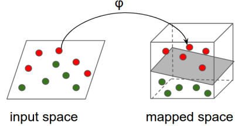
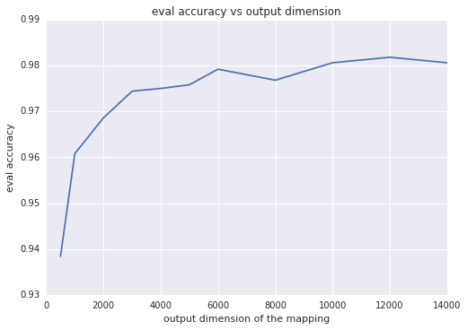
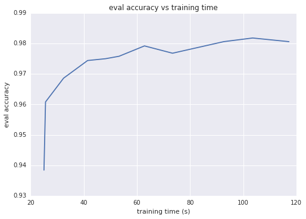

# 使用特定的核方法改善线性模型

注意：这篇文档使用的是已经被弃用了的 `tf.estimator`，`tf.contrib.learn.Estimator`，他们的界面是不同的。它还使用了 `contrib` 方法的[可能不稳定的 API](../../guide/version_compat.md#not_covered)。

在这篇教程里，我们将示范如何把特定核方法和线性模型结合起来在不明显增加训练和推理时间的情况下大幅度提升预测质量。与多核方法不同，特定核心方法对训练数据集的大小具有很好的可扩展性，不管是在训练和推理时间上还是在内存占用上。


**目标读者：** 尽管我们提供的只是特定核方法相关概念的一个概览，教程的主要目标读者依然要具备核方法和支持向量机的基础知识，这些知识可以参考以下的资源做一个了解：

* 如果你有很强的数学背景，请参考：[机器学习中的核方法](https://arxiv.org/pdf/math/0701907.pdf)
* 或者[核方法维基百科](https://en.wikipedia.org/wiki/Kernel_method)

目前，TensorFlow 只支持对于密集特征的特定核映射。对于稀疏特征的支持将在后面的发布版本中提供。

本教程使用 [tf.contrib.learn](https://www.tensorflow.org/code/tensorflow/contrib/learn/python/learn)（TensorFlow 机器学习高级接口）估测器作为我们的机器学习模型。如果你对这份 API 不熟悉，可以参考 [Estimator guide](../../guide/estimators.md)。我们将使用 MNIST 数据集。本教程包含以下步骤：

* 为分类下载和准备 MNIST 数据。
* 构建一个简单的线性模型，训练并在评估数据上评估。
* 用核化的线性模型替换线性模型，再次训练，评估。

## 为分类任务下载和准备 MNIST 数据

运行如下的工具命令来下载 MNIST 数据集：

```python
data = tf.contrib.learn.datasets.mnist.load_mnist()
```

上面的方法下载了整个 MNIST 数据集（包含 70K 的样本），并分成大小分别为 55K, 5K 和 10K 的训练，验证和测试集。每次分割包含一个 numpy 图像数组（维度大小为 [样本大小, 784]）和一个 numpy 标签数组（shape 为 [样本大小, 1])。在本教程中，我们仅使用训练和验证集来分别训练和验证我们的模型。

为了将数据输入给 `tf.contrib.learn.Estimator`，将其转换为一个张量是很有必要的。为此，我们需要使用一个`输入函数`，将运算符添加至 TensorFlow 的计算图中。当计算图执行时，将张量的一个小批量创建为下游使用的数据。更多关于输入函数的背景，请查看[这一节的输出函数介绍](../../guide/premade_estimators.md#create_input_functions)。在本例中，我们将使用 `tf.train.shuffle_batch` 运算符，它除了会将 numpy 数组转换为张量外，还允许我们指定 `batch_size` 以及是否每次都需要将输入数据随机化（随机化通常会加速训练的收敛）。下面是加载和准备数据的完整代码。在这个代码片段中，我们使用了 356 大小的小批量数据作为训练输入，以及整（5K）个样本用于评估。你也可以自行设置数据批量的大小

```python
import numpy as np
import tensorflow as tf

def get_input_fn(dataset_split, batch_size, capacity=10000, min_after_dequeue=3000):

  def _input_fn():
    images_batch, labels_batch = tf.train.shuffle_batch(
        tensors=[dataset_split.images, dataset_split.labels.astype(np.int32)],
        batch_size=batch_size,
        capacity=capacity,
        min_after_dequeue=min_after_dequeue,
        enqueue_many=True,
        num_threads=4)
    features_map = {'images': images_batch}
    return features_map, labels_batch

  return _input_fn

data = tf.contrib.learn.datasets.mnist.load_mnist()

train_input_fn = get_input_fn(data.train, batch_size=256)
eval_input_fn = get_input_fn(data.validation, batch_size=5000)

```

## 训练一个简单的线性模型

现在我们可以使用 MNIST 数据集训练一个线性模型。我们将使用 `tf.contrib.learn.LinearClassifier` 估测器，10 个分类分别用 0-9 表示。输入特征组成一个 784 维的密集向量，可以通过如下方式指定：

```python
image_column = tf.contrib.layers.real_valued_column('images', dimension=784)
```

构建、训练和评估一个线性分类器估测器的完整代码如下：

```python
import time

# 指定估测器要使用的特征
image_column = tf.contrib.layers.real_valued_column('images', dimension=784)
estimator = tf.contrib.learn.LinearClassifier(feature_columns=[image_column], n_classes=10)

# 训练
start = time.time()
estimator.fit(input_fn=train_input_fn, steps=2000)
end = time.time()
print('Elapsed time: {} seconds'.format(end - start))

# 评估并报告结果
eval_metrics = estimator.evaluate(input_fn=eval_input_fn, steps=1)
print(eval_metrics)
```
下面这张表总结了评估数据的结果。

度量        | 值
:------------ | :------------
loss          | 0.25 到 0.30
accuracy      | 92.5%
training time | 在我的机器上约 25 秒

注意：评估结果会因各种因素的影响而不同。

除了可以试验不同的批次大小和训练步骤的数量，有一些其他的因素同样可以被调优。例如，你可以通过从[可用优化器列表](https://www.tensorflow.org/code/tensorflow/python/training)明确地选择另外的优化器，改变用于最小化损失函数的优化方法来优化评估结果。作为示例，下面的代码构造了一个使用特定学习速率和 L2 正规化的 FTRL（Follow-The-Regularized-Leader）优化策略的线性分类估测器。

```python
optimizer = tf.train.FtrlOptimizer(learning_rate=5.0, l2_regularization_strength=1.0)
estimator = tf.contrib.learn.LinearClassifier(
    feature_columns=[image_column], n_classes=10, optimizer=optimizer)
```

不管这些参数的值，线性模型在这个数据集上能取得的最大精确度约为**93%**。

## 在线性模型上使用特定核映射

线性模型在 MNIST 数据上的相对较高的错误率（大概 7%）表明输入数据不是可线性分割的。我们将使用特定的核映射来降低分类误差。

**直觉上：** 总体思路是用一个非线性的映射关系将输入空间转换到另一个特征空间（可能有更高的维数），这个特征空间几乎是可线性分割的，然后把一个线性模型应用到这个映射特征空间里。这个过程可以通过下面这张图反映：

<div style="text-align:center">

</div>

### 技术细节

这个例子中我们将使用 **随机傅里叶特征**，在 Rahimi 和 Recht 的对输入数据做映射的论文中首次引进，["大规模核机器的随机特征"](https://people.eecs.berkeley.edu/~brecht/papers/07.rah.rec.nips.pdf)。随机傅里叶特征通过如下方式将矢量 \\(\mathbf{x} \in \mathbb{R}^d\\)映射到 \\(\mathbf{x'} \in \mathbb{R}^D\\)：

$$
RFFM(\cdot): \mathbb{R}^d \to \mathbb{R}^D, \quad
RFFM(\mathbf{x}) =  \cos(\mathbf{\Omega} \cdot \mathbf{x}+ \mathbf{b})
$$

其中 \\(\mathbf{\Omega} \in \mathbb{R}^{D \times d}\\), \\(\mathbf{x} \in \mathbb{R}^d,\\) \\(\mathbf{b} \in \mathbb{R}^D\\) 且余弦逐元素运算。

在本例中，\\(\mathbf{\Omega}\\) 和 \\(\mathbf{b}\\) 的实体是分布中取样得来的以使映射具有如下性质：

$$
RFFM(\mathbf{x})^T \cdot RFFM(\mathbf{y}) \approx
e^{-\frac{\|\mathbf{x} - \mathbf{y}\|^2}{2 \sigma^2}}
$$

上面表达式右边的式子就是著名的 RBF （高斯）核函数。这个函数是机器学习中应用最广泛的核函数之一，相比原始函数它可以在不同和更高的维度空间中模糊地衡量相似性。

### 核分类器

`tf.contrib.kernel_methods.KernelLinearClassifier` 是一个预先打包的 `tf.contrib.learn` 估测器，结合了线性模型和特定核映射的优点。它的构造器几乎与可配置核映射的线性分类估测器相同。下面的代码演示如何使用线性核分类器替换线性分类器。

```python

# 指定估测器将要使用的特征。这和线性分类器中的代码是相同的
image_column = tf.contrib.layers.real_valued_column('images', dimension=784)
optimizer = tf.train.FtrlOptimizer(
   learning_rate=50.0, l2_regularization_strength=0.001)

kernel_mapper = tf.contrib.kernel_methods.RandomFourierFeatureMapper(
  input_dim=784, output_dim=2000, stddev=5.0, name='rffm')
kernel_mappers = {image_column: [kernel_mapper]}
estimator = tf.contrib.kernel_methods.KernelLinearClassifier(
   n_classes=10, optimizer=optimizer, kernel_mappers=kernel_mappers)

# 训练
start = time.time()
estimator.fit(input_fn=train_input_fn, steps=2000)
end = time.time()
print('Elapsed time: {} seconds'.format(end - start))

# 评估和报告结果
eval_metrics = estimator.evaluate(input_fn=eval_input_fn, steps=1)
print(eval_metrics)
```

唯一增加的一个参数是传递给 `KernelLinearClassifier` 的一个字典，
这个字典提供从特征列到一组核的映射。下面的几行构造了使用随机傅立叶特征来映射初始化的 784 维图像到一个 2000 维的矢量的一个分类器，然后在经过转换的矢量上进行学习。

```python
kernel_mapper = tf.contrib.kernel_methods.RandomFourierFeatureMapper(
  input_dim=784, output_dim=2000, stddev=5.0, name='rffm')
kernel_mappers = {image_column: [kernel_mapper]}
estimator = tf.contrib.kernel_methods.KernelLinearClassifier(
   n_classes=10, optimizer=optimizer, kernel_mappers=kernel_mappers)
```

注意 `stddev` 参数。它是 RBF 核近似的标准差并在分类任务里用于控制相似性衡量。`stddev` 通常通过超参数调教决定。

先前代码的运行结果总结在下面这张表里。我们可以通过提高映射输出维数和对标准差调优进一步提高准确性。

度量  | 值
:------------ | :------------
loss          | 0.10
accuracy      | 97%
training time | 在我的机器上约 35 秒


### stddev

分类的质量对 stddev 的值非常敏感。下面这张表显示的是分类器在不同 stddev 上的评估数据的准确性。最优值是 stddev=5.0。注意看太大或者太小的 stddev 值是怎样迅速地降低分类的准确性的。

stddev | 评估精度
:----- | :------------
1.0    | 0.1362
2.0    | 0.4764
4.0    | 0.9654
5.0    | 0.9766
8.0    | 0.9714
16.0   | 0.8878

### 输出维数

直觉上，映射的输出维数越大，两个映射的矢量的内积越近似这个核，通常都会转化成更好的分类准确性。另一个思考这个问题的方式是输出维数等于线性模型的权重数；维数越大，模型的自由度越大。然而，超过一定的阈值，随着训练次数的增加，高输出维数会增加训练时间，对准确性的提升作用却变得非常小。下面两张图分别描述了评价准确性对输出维数和训练时间的函数变化





## 总结

特定核映射结合了非线性模型的前瞻性和线性模型的可伸缩性的优点。与传统的多核心方法相比，特定核方法可以覆盖覆盖数百万或数亿量级的实例。当运用特定核映射时，请考虑如下几点：

* 对于密集特征数据集，随机傅立叶特征特别有效
* 核映射的参数经常是独立于数据的。模型质量对于这些参数非常敏感。使用超参数调优找到最优值。
* 如果有多个数字特征，把他们连接到一个单独的多维特征中然后在这些连接数据上运用核映射。
