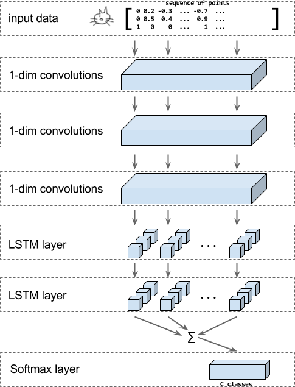
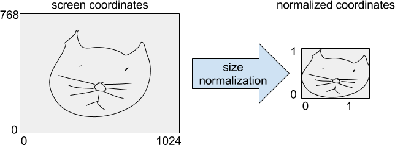

# 循环神经网络——涂鸦分类

[Quick, Draw!]: http://quickdraw.withgoogle.com

[Quick, Draw!](http://quickdraw.withgoogle.com) 是一个涂鸦游戏，玩家需要画出一系列物体，看电脑能否识别。

游戏中的识别功能由一个分类器完成，其输入是玩家的涂鸦，由一连串的笔画（笔画由一系列点的坐标构成）组成，输出则是涂鸦所对应的物体类别。

在这个教程中，我们将会展示如何为这个游戏构建一个基于 RNN （循环神经网络）的分类器。模型将会使用卷积层、LSTM 层以及一个 softmax 输出层来分辨涂鸦的类别。

<center>  </center>

上面的图片展示了模型的架构。涂鸦被编码成一系列坐标点组（x, y），以及 n，用来表明该点是否是作为一笔画的起点。

接下来，我们将应用一系列一维的卷积，然后使用 LSTM 层，LSTM 每一时间步的输出之和会交给 softmax 层，最终在已知的涂鸦类别中给出分类的结果。

本教程会使用 [Quick, Draw!] 游戏的真实数据集，数据集是[公开](https://quickdraw.withgoogle.com/data)的，其中包括了 345 个类别的约 5 千万张涂鸦。

## 运行教程代码

你可以尝试本教程的代码：

1.  @{$install$Install TensorFlow} 如果你还没有安装 TensorFlow 的话，请先安装。
2.  下载[教程代码](https://github.com/tensorflow/models/tree/master/tutorials/rnn/quickdraw/train_model.py)。
3.  从[这里](http://download.tensorflow.org/data/quickdraw_tutorial_dataset_v1.tar.gz)下载 `TFRecord` 格式的[数据](#下载数据)，并且解压，如何转换为 `TFRecord` 文件的方法在[下面](#数据格式转换)。
4.  使用下列的命令运行代码，并且训练教程中的基于 RNN 的模型。请确保已经把路径更改为第三步中下载解压过的数据所在的位置。

```shell
  python train_model.py \
    --training_data=rnn_tutorial_data/training.tfrecord-?????-of-????? \
    --eval_data=rnn_tutorial_data/eval.tfrecord-?????-of-????? \
    --classes_file=rnn_tutorial_data/training.tfrecord.classes
```

## 细节

### 下载数据

我们把教程使用的数据转换成了 `TFRecord` 格式，其中包括了 `TFExamples`，你可以从下面的地址下载这个数据集：

http://download.tensorflow.org/data/quickdraw_tutorial_dataset_v1.tar.gz

你也可以在 Google Cloud 下载原始的 `ndjson` 格式的数据集，然后根据下一节的教程转换成同样的 `TFRecord` 格式。

### 下载完整数据集

Google Cloud 上完整的 [Quick, Draw!](https://quickdraw.withgoogle.com) [数据集](https://quickdraw.withgoogle.com/data)是以 [ndjson](http://ndjson.org/) 格式分类别储存的。你可以在云控制台浏览[文件列表](https://console.cloud.google.com/storage/quickdraw_dataset)。

我们推荐使用 [gsutil](https://cloud.google.com/storage/docs/gsutil_install#install) 来下载完整的数据集，整个 `.ndjson` 文件集的大小约为 22GB。

然后你可以使用下列的命令来检查你的 `gsutil` 是否正确安装，并且有相应的下载权限：

```shell
gsutil ls -r "gs://quickdraw_dataset/full/simplified/*"
```

其输出是一长串文件列表，如下所示：

```shell
gs://quickdraw_dataset/full/simplified/The Eiffel Tower.ndjson
gs://quickdraw_dataset/full/simplified/The Great Wall of China.ndjson
gs://quickdraw_dataset/full/simplified/The Mona Lisa.ndjson
gs://quickdraw_dataset/full/simplified/aircraft carrier.ndjson
...
```

接下来创建一个文件夹，并且把数据集下载到里面：

```shell
mkdir rnn_tutorial_data
cd rnn_tutorial_data
gsutil -m cp "gs://quickdraw_dataset/full/simplified/*" .
```

下载可能会要等上一段时间，毕竟有 23GB 的数据。

### 数据格式转换

把 `ndjson` 文件转换为 @{$python/python_io#tfrecords_format_details$TFRecord} 格式，其中含有 ${tf.train.Example} ，请运行下列的命令：

```shell
   python create_dataset.py --ndjson_path rnn_tutorial_data \
      --output_path rnn_tutorial_data
```

这个命令会将所有的数据存在 10 块 @{$python/python_io#tfrecords_format_details$TFRecord} 文件中。其中每个类别有 10000 张图片，以此构成训练集；另外，每个类别的 1000 张图片构成了测试集。

格式转换的细节如下：

原始的 QuickDraw 数据的格式是 `ndjson`，其中每行都包含了一个 JSON 对象，如下所示：

```json
{"word":"cat",
 "countrycode":"VE",
 "timestamp":"2017-03-02 23:25:10.07453 UTC",
 "recognized":true,
 "key_id":"5201136883597312",
 "drawing":[
   [
     [130,113,99,109,76,64,55,48,48,51,59,86,133,154,170,203,214,217,215,208,186,176,162,157,132],
     [72,40,27,79,82,88,100,120,134,152,165,184,189,186,179,152,131,114,100,89,76,0,31,65,70]
   ],[
     [76,28,7],
     [136,128,128]
   ],[
     [76,23,0],
     [160,164,175]
   ],[
     [87,52,37],
     [175,191,204]
   ],[
     [174,220,246,251],
     [134,132,136,139]
   ],[
     [175,255],
     [147,168]
   ],[
     [171,208,215],
     [164,198,210]
   ],[
     [130,110,108,111,130,139,139,119],
     [129,134,137,144,148,144,136,130]
   ],[
     [107,106],
     [96,113]
   ]
 ]
}
```

构建一个分类器我们只需要 `word` 和 `drawing` 这两个字段的属性。解析 `ndjson` 文件的时候，我们编写一个函数来逐行进行处理。首先我们把 `drawing` 字段中的点转换为形为 `[点的数量，3]` 的张量，同时把涂鸦对应的类型名字以 string 类型返回。

```python
def parse_line(ndjson_line):
"""解析 ndjson 文件的一行并且返回笔画的坐标(以 np array 的格式)以及类型名称"""
  sample = json.loads(ndjson_line)
  class_name = sample["word"]
  inkarray = sample["drawing"]
  stroke_lengths = [len(stroke[0]) for stroke in inkarray]
  total_points = sum(stroke_lengths)
  np_ink = np.zeros((total_points, 3), dtype=np.float32)
  current_t = 0
  for stroke in inkarray:
    for i in [0, 1]:
      np_ink[current_t:(current_t + len(stroke[0])), i] = stroke[i]
    current_t += len(stroke[0])
    np_ink[current_t - 1, 2] = 1  # 笔画的最后一个点
  # 预处理
  # 1. 正则化
  lower = np.min(np_ink[:, 0:2], axis=0)
  upper = np.max(np_ink[:, 0:2], axis=0)
  scale = upper - lower
  scale[scale == 0] = 1
  np_ink[:, 0:2] = (np_ink[:, 0:2] - lower) / scale
  # 2. 计算方差
  np_ink = np_ink[1:, 0:2] - np_ink[0:-1, 0:2]
  return np_ink, class_name
```

我们需要打乱数据集以便写入，因此我们从每个类别的文件中随机的读取并且存入一个被打乱的数据集。

训练集上，我们从每个类别读取 10000 张图片，而测试集则是每个类别 1000 张。

接下来，数据会被转换成形为 `[训练样本数量, 最大长度, 3]` 的张量，接下来我们会确定原始涂鸦的边界，并且进行尺寸的正则化，使每张图片具有相同的大小。

<center>  </center>

最后，我们计算一系列点的方差并且在储存为`VarLenFeature`，作为键 `key` 的一个 [tensorflow.Example](https://www.tensorflow.org/code/tensorflow/core/example/example.proto) 对象。此外，我们同时把类别的索引储存在一个单独的条目 `FixedLengthFeature` 中，并且其笔画的形状为长度为 2 的 `FixedLengthFeature` 。

### 定义模型

我们通过创建一个新的 `Estimator` （评估器）来定义一个模型，如果你想要了解更多关于评估器的内容，我们推荐阅读  @{$get_started/custom_estimators$this tutorial}。

构建模型分为四步:

1.  将输入变形为原始的形状：将 mini-batch 中每个样本填充到其内容的最大长度。除了笔画数据以外，我们还有每个样本以及目标类的长度，我们通过函数 [`_get_input_tensors`](#_get_input_tensors) 来完成这一操作。
2.  在函数 [`_add_conv_layers`](#_add_conv_layers) 中将输入通过一系列卷积层。
3.  将卷积后的结果交给一个双向 LSTM，最后，每个时间步的输出会被求和，从而输入最终被编码成一个密集的固定长度的向量。这一切发生在 [`_add_rnn_layers`](#_add_rnn_layers) 中。
4.  在 [`_add_fc_layers`](#_add_fc_layers) 中用一个 softmax 层来获取最终的分类结果。

代码如下：

```python
inks, lengths, targets = _get_input_tensors(features, targets)
convolved = _add_conv_layers(inks)
final_state = _add_rnn_layers(convolved, lengths)
logits =_add_fc_layers(final_state)
```

### _get_input_tensors

我们从特征字典中获取输入的形状，然后据此创建一个一维的张量，其形状为 `[batch_size]`，其中包含了各个输入的长度。笔画以 SparseTensorf 的类型储存在特征字典中，我们先将其转化为一个密集向量然后再形变为 `[batch_size, ?, 3]`。最后，我们对传入的参数 `tartget` 进行检查以确保其形状是形为 `[batch_size]` 的一维张量。

代码如下所示：

```python
shapes = features["shape"]
lengths = tf.squeeze(
    tf.slice(shapes, begin=[0, 0], size=[params["batch_size"], 1]))
inks = tf.reshape(
    tf.sparse_tensor_to_dense(features["ink"]),
    [params["batch_size"], -1, 3])
if targets is not None:
  targets = tf.squeeze(targets)
```

### _add_conv_layers

卷积层的数量和滤波器的长度通过 `params` 字典中的 `num_conv` 和 `conv_len` 来进行配置。

输入是一个三维的序列，我们将会使用一维的卷积操作，所以我们把第三维的数据看做是图像的色彩通道。这意味着输入的形状为 `[batch_size, length, 3]`，那么输出的张量形状则会是 `[batch_size, length, number_of_filters]`。

```python
convolved = inks
for i in range(len(params.num_conv)):
  convolved_input = convolved
  if params.batch_norm:
    convolved_input = tf.layers.batch_normalization(
        convolved_input,
        training=(mode == tf.estimator.ModeKeys.TRAIN))
  # 如果启用了 dropout，则在除第一层以外的卷积层后增加 dropout 层
  if i > 0 and params.dropout:
    convolved_input = tf.layers.dropout(
        convolved_input,
        rate=params.dropout,
        training=(mode == tf.estimator.ModeKeys.TRAIN))
  convolved = tf.layers.conv1d(
      convolved_input,
      filters=params.num_conv[i],
      kernel_size=params.conv_len[i],
      activation=None,
      strides=1,
      padding="same",
      name="conv1d_%d" % i)
return convolved, lengths
```

### _add_rnn_layers

我们将卷积的输出交给一个双向的 LSTM 层，我们会使用 contrib 包中的函数：

```python
outputs, _, _ = contrib_rnn.stack_bidirectional_dynamic_rnn(
    cells_fw=[cell(params.num_nodes) for _ in range(params.num_layers)],
    cells_bw=[cell(params.num_nodes) for _ in range(params.num_layers)],
    inputs=convolved,
    sequence_length=lengths,
    dtype=tf.float32,
    scope="rnn_classification")
```

你可以阅读源码来了解如何使用 `CUDA` 以加速计算的实现。

我们对 LSTM 的结果进行求和得到一个密集的固定长度的向量。笔画序列被填充为 0 的部分不参与到结果的计算之中。

```python
mask = tf.tile(
    tf.expand_dims(tf.sequence_mask(lengths, tf.shape(outputs)[1]), 2),
    [1, 1, tf.shape(outputs)[2]])
zero_outside = tf.where(mask, outputs, tf.zeros_like(outputs))
outputs = tf.reduce_sum(zero_outside, axis=1)
```

### 添加全连接层

输入的编码将交给一个全连接层，随后我们再将其输出交给 softmax 层。

```python
tf.layers.dense(final_state, params.num_classes)
```

### 损失函数，预测以及优化器

最后，我们需要设置损失函数、训练操作以及模型预测来完成 `ModelFn` 的构建：

```python
cross_entropy = tf.reduce_mean(
    tf.nn.sparse_softmax_cross_entropy_with_logits(
        labels=targets, logits=logits))
# 增加优化器
train_op = tf.contrib.layers.optimize_loss(
    loss=cross_entropy,
    global_step=tf.train.get_global_step(),
    learning_rate=params.learning_rate,
    optimizer="Adam",
    # 使用一些梯度裁剪技术来帮助模型在训练刚开始时更稳定
    clip_gradients=params.gradient_clipping_norm,
    summaries=["learning_rate", "loss", "gradients", "gradient_norm"])
predictions = tf.argmax(logits, axis=1)
return model_fn_lib.ModelFnOps(
    mode=mode,
    predictions={"logits": logits,
                 "predictions": predictions},
    loss=cross_entropy,
    train_op=train_op,
    eval_metric_ops={"accuracy": tf.metrics.accuracy(targets, predictions)})
```

### 训练和评估模型

我们使用 `Estimator` 和 `Experiment` 的 API 来方便地训练和评估我们的模型：

```python
  estimator = tf.estimator.Estimator(
      model_fn=model_fn,
      model_dir=output_dir,
      config=config,
      params=model_params)
  # 训练模型
  tf.contrib.learn.Experiment(
      estimator=estimator,
      train_input_fn=get_input_fn(
          mode=tf.contrib.learn.ModeKeys.TRAIN,
          tfrecord_pattern=FLAGS.training_data,
          batch_size=FLAGS.batch_size),
      train_steps=FLAGS.steps,
      eval_input_fn=get_input_fn(
          mode=tf.contrib.learn.ModeKeys.EVAL,
          tfrecord_pattern=FLAGS.eval_data,
          batch_size=FLAGS.batch_size),
      min_eval_frequency=1000)
```

这篇教程旨在帮助你熟悉循环神经网络的 API 以及评估器的使用，因而只是在一个比较小的数据集上进行了实验。如果使用更大的数据集的话，模型会取得更加优异的表现。

训练一百万步之后，你应该能够得到一个准确率约为 70% 的模型。这个结果足以来构建一个快速涂鸦游戏了，因为玩家能够不断地调整他的画作直到被识别。同时，这个游戏不一定要求模型给出完全正确的判断，而只要对应类别的概率高于一定的阈值，就认可玩家的涂鸦。
